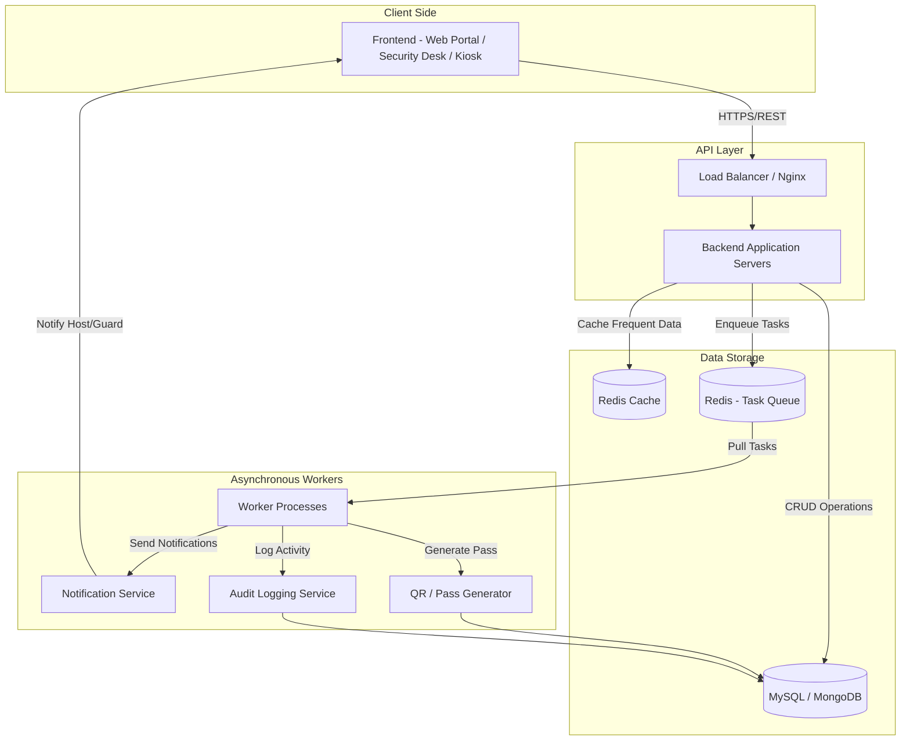
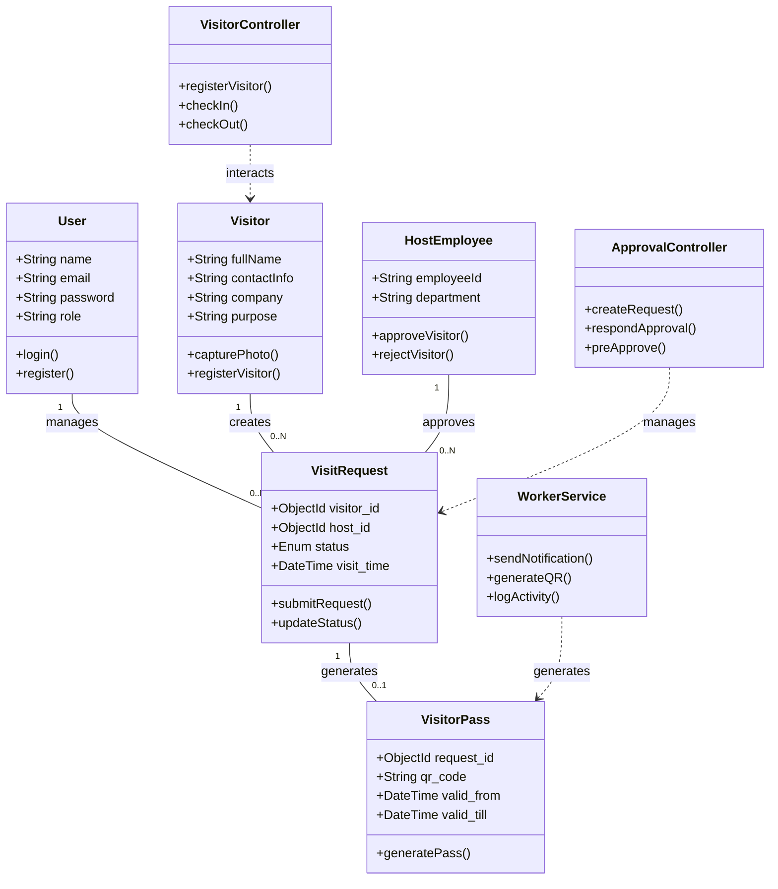
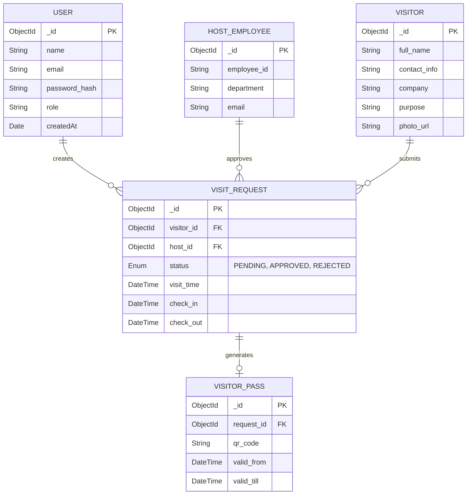

# Visitor Management System Design

This document provides a comprehensive overview of the architecture, data flow, and database structure for the Visitor Management System (VMS).

---

## High-Level Design (HLD)

This diagram illustrates the data flow from the frontend to the database, incorporating **Redis Cache and Workers** for asynchronous processing.

---

## Low-Level Design (LLD) - Class Diagram

The class diagram outlines the relationships between controllers, models, and core services.

---

## Entity-Relationship (ER) Diagram

A relational view of the database schemas and their constraints.

---

## Table Definitions & Idea

| Table (Collection) | Description | Key Fields | Purpose |
|---|---|---|---|
| Users | System users (Admin, Guard) | _id, email, password_hash, role | Authentication & access |
| HostEmployees | Employees receiving visitors | _id, employee_id, department | Approval authority |
| Visitors | Visitor details | _id, full_name, contact_info, purpose | Identity tracking |
| VisitRequests | Approval workflow | _id, visitor_id, host_id, status | Core logic |
| VisitorPasses | QR-based entry pass | _id, request_id, qr_code | Entry validation |
| AuditLogs | System logs | _id, action, user_id, timestamp | Monitoring |

---

## Data Flow Breakdown (Visual Summary)

1. Frontend: Security guard enters visitor details  
2. API: VisitorController.registerVisitor handles request  
3. Database: Visitor stored  
4. Request: VisitRequest created with status PENDING  
5. Queue: Task sent to Redis  
6. Worker: Notifies host employee  
7. Approval: Host approves/rejects  
8. Pass: QR-based visitor pass generated  
9. Check-in: Visitor enters  
10. Check-out: Exit recorded  
11. Logs: Stored for audit  

---

## Caching

- Cache frequently accessed data such as employee details and active visitor passes  
- Improves response time  
- Reduces database load  
- Example: QR validation can be done via Redis instead of DB  

---

## Authentication & Authorization

- Role-based access:
  - Admin
  - Security Guard
  - Host Employee  

- Secure login using JWT / sessions  
- Ensures only authorized access  

---

## Reliability & Failure Handling

- Backup and recovery mechanisms  
- Retry failed notifications  
- Graceful error handling  
- Audit logging for debugging  

---

## Trade-offs

- Security vs Convenience  
- Performance vs Data Freshness (Caching)  
- Real-time processing vs system complexity  

---

## Conclusion

The Visitor Management System improves campus security, automates visitor tracking, and ensures efficient and scalable access control using modern system design principles.
